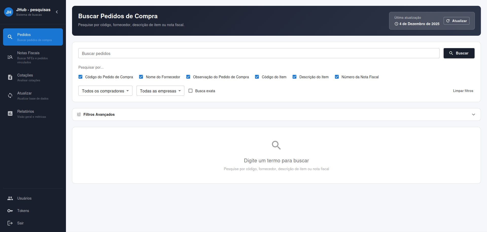

# FoccoERP Frontend

This React frontend provides a comprehensive interface for managing and searching FoccoERP data. It was bootstrapped with [Create React App](https://github.com/facebook/create-react-app).

## Features

- **Advanced Search**: Search through NFE and purchase order data with ease
- **Dashboard**: Overview of tracked companies and their data
- **Import**: Upload and import Excel files for bulk data management
- **NFE Details**: View detailed information about Notas Fiscais Eletrônicas
- **Quotation Analysis**: Analyze and compare quotations
- **User Authentication**: Secure login and registration system

## Available Scripts

In the project directory, you can run:

### `npm start`

Runs the app in the development mode.\
Open [http://localhost:3000](http://localhost:3000) to view it in your browser.

The page will reload when you make changes.\
You may also see any lint errors in the console.

### `npm test`

Launches the test runner in the interactive watch mode.\
See the section about [running tests](https://facebook.github.io/create-react-app/docs/running-tests) for more information.

### `npm run build`

Builds the app for production to the `build` folder.\
It correctly bundles React in production mode and optimizes the build for the best performance.

The build is minified and the filenames include the hashes.\
Your app is ready to be deployed!

