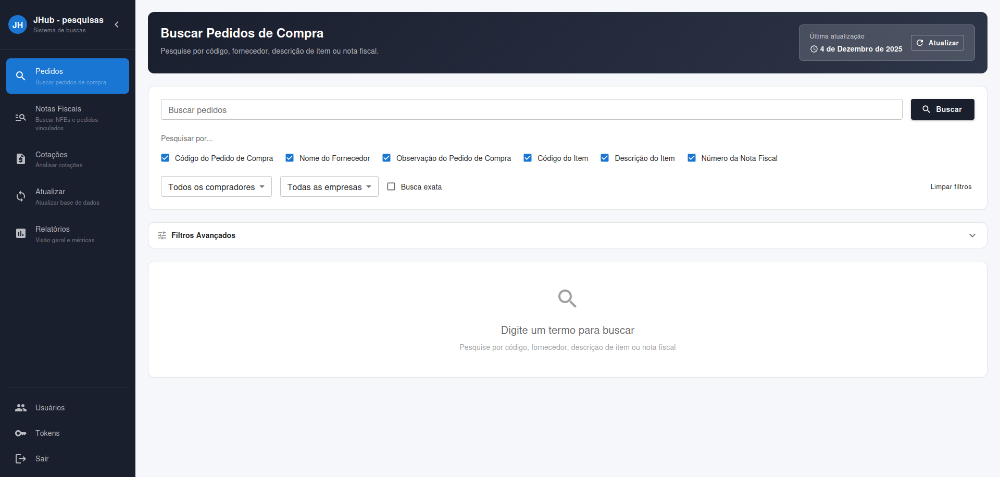

# FoccoERP Frontend

This React frontend provides a comprehensive interface for managing and searching FoccoERP data. Built with [Vite](https://vitejs.dev/) for fast development and optimized builds.

## Features

- **Advanced Search**: Search through NFE and purchase order data with ease
- **Dashboard**: Overview of tracked companies and their data
- **Import**: Upload and import Excel files for bulk data management
- **NFE Details**: View detailed information about Notas Fiscais Eletrônicas
- **Quotation Analysis**: Analyze and compare quotations
- **User Authentication**: Secure login and registration system

## Available Scripts

In the project directory, you can run:

### `npm run dev`

Runs the app in development mode with hot module replacement (HMR).\
Open [http://localhost:5173](http://localhost:5173) to view it in your browser.

The page will automatically update when you make changes.

### `npm run build`

Builds the app for production to the `dist` folder.\
Vite optimizes the build with tree-shaking, code-splitting, and minification for the best performance.

The build is optimized and ready to be deployed!

### `npm run preview`

Preview the production build locally.\
Useful for testing the optimized build before deployment.

